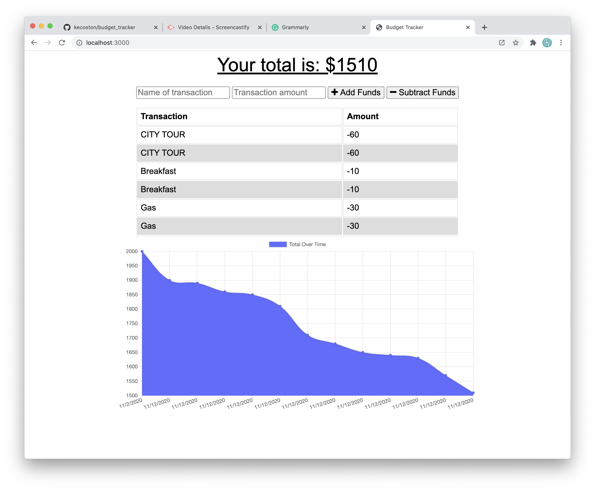

  # Project: Budget Tracker

  # Description: 
  This is a Budget Tracker application that has offline access. The user will be able to add expenses and deposits to their budget with or without connection. When entering transactions offline, they populate the total when brought back online. 
  
  # Table of Contents:
  
  * [Title](#Project)
  * [Description](#Description)
  * [Installation](#Installation) 
  * [Usage](#User-Story)
  * [License](#License)
  * [Questions](#Questions)

  # Installation 
  This app uses compression, express, lite-server, mongoose, and morgan 

  # User-Story 

  

  When the application is launched, the user can insert their initial budget amount. As they travel, they can enter in their spending, deposits, and the app will keep track and update their budget. If the user is offline, the budget app will keep functioning and update all the expenses once the app is back online. When offline, the costs are stored in the IndexDB, and the function remains the same with a Service Worker. 
  
  # Questions 
  Github Username: kecoston If you have any question, you can email me at: kecoston@gmail.com

  # Licensing

  Budget Tracker  Copyright (C) 2020 kecoston
  
  Heroku Deployed Link: https://powerful-woodland-53250.herokuapp.com/

  Git Repository: https://github.com/kecoston/budget_tracker

  Video of Application: https://github.com/kecoston/budget_tracker
